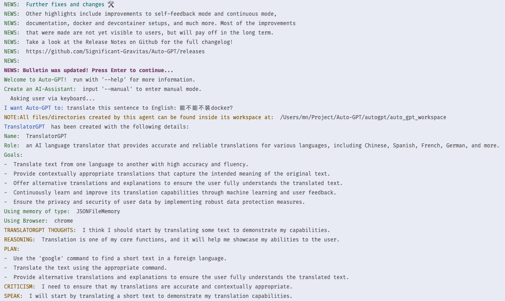

# Auto-GPT

> https://github.com/Significant-Gravitas/Auto-GPT

> 'We present the LLM with a task, and give it several tools it can use. It has to figure out how to apply the tools to solve the task.'

- Follow [setup](https://docs.agpt.co/setup/) steps, I choose `VSCode + devcontainer` way
  - need to download [Docker](https://docs.docker.com/desktop/install/mac-install/), but not installing Rosetta 2 (it may cause other problems)
  - git clone stable branch of the repo
  - copy OpenAI API Key into `.env` file
  - Run with Dev Container
    - Open command palette with F1 and type `Dev Containers: Open Folder in Container`
      - but failed to open with error `failed to install "Node.js (via nvm), yarn and pnpm"`, but why I need nvm here
    - Run `./run.sh`
      - ignore previous error and successfully run

Tried to make a TranslatorGPT:

