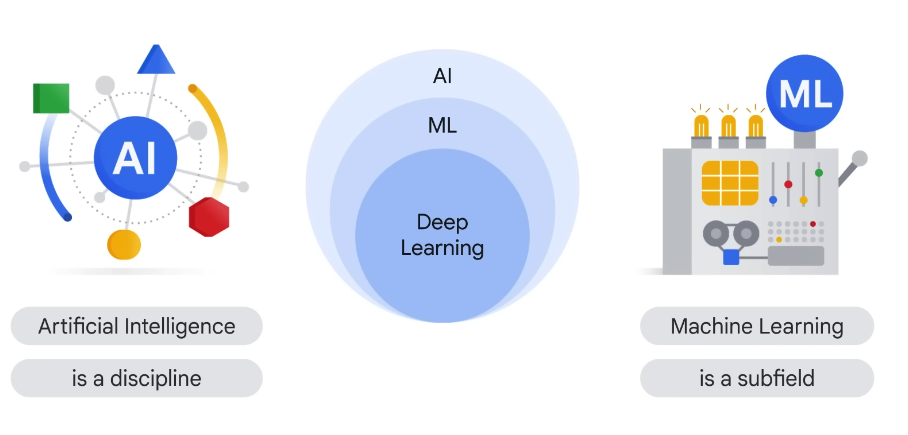
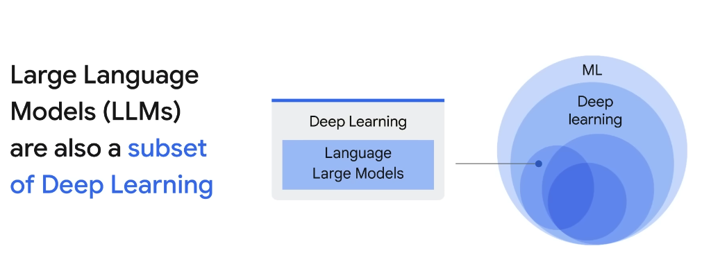
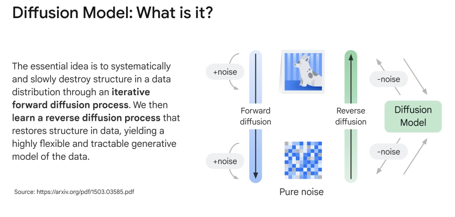
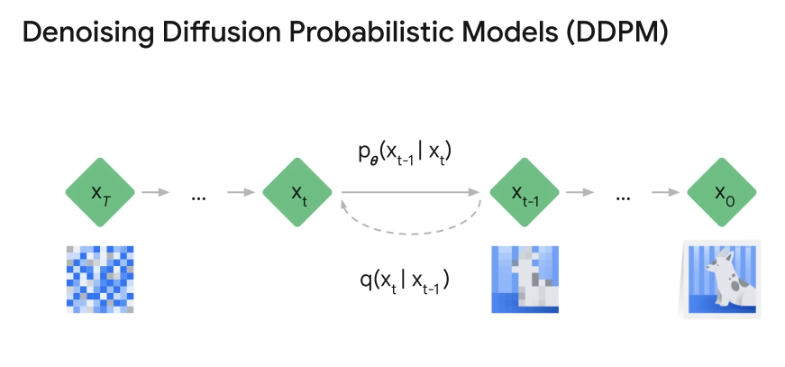
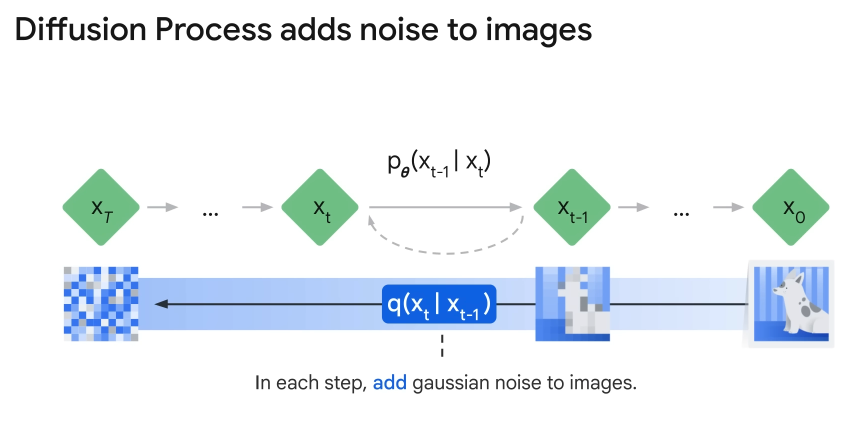
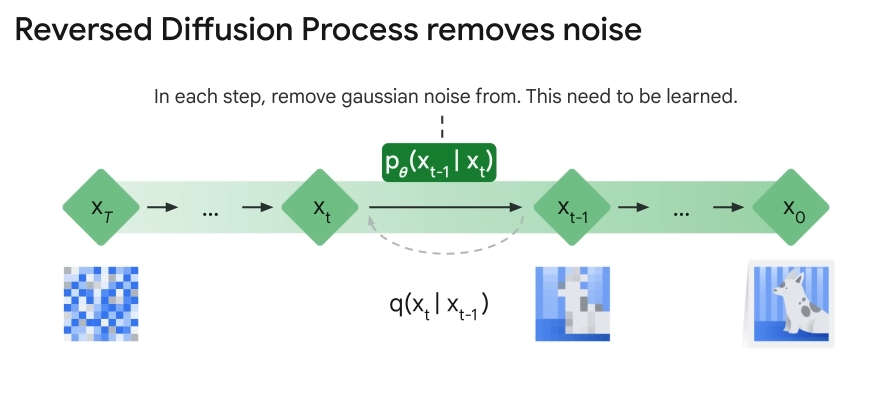
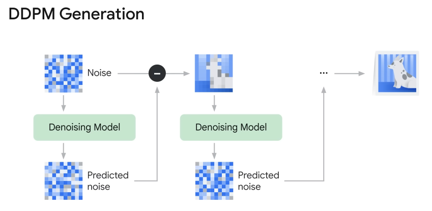
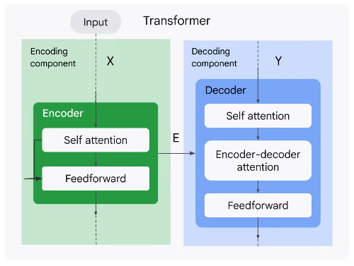
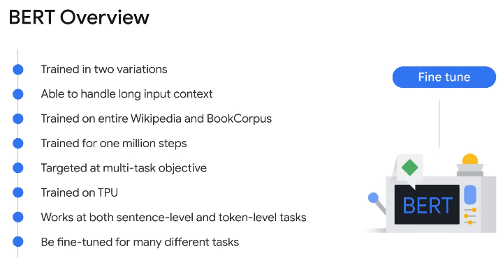

## Introduction to Generative AI

- AI is the theory and development of computer systems able to perform tasks normally
  requiring human intelligence.
- ML (Machine Learning) gives computers the ability to learn without explicit programming.
  - Unsupervised ML models (not labeled)
  - Supervised ML models
  - Reinforcement learning
  - Deep learning, is a subset of ML, using Artificial Neural Networks
    - Generative AI, is a subset of Deep learning
    - Large Language Models (LLMs) are also a subset of Deep learning

- A prompt is a short piece of text that is given to the large language model as input,
  and it can be used to control the output of the model in many ways.
- A foundation model is a large AI model pretrained on a vast quantity of data
  that was "designed to be adapted” (or fine-tuned) to a wide range of downstream tasks,
  such as sentiment analysis, image captioning, and object recognition.
- Hallucinations are words or phrases that are generated by the model
  that are often *nonsensical or grammatically incorrect*. It can be caused by:
  - The model is not trained on enough data.
  - The model is trained on noisy or dirty data.
  - The model is not given enough context.
  - The model is not given enough constraints.
- Generative AI is a type of artificial intelligence (AI) that can create new content,
  such as text, images, audio, and video. It does this by learning from existing data
  and then using that knowledge to generate new and unique outputs.

## Introduction to Large Language Models

- LLMs refer to large general-purpose language models can be pre-trained and then fine-tuned for specific purposes.
- 3 features:
  - Large:
    - Large training dataset
    - Large number of parameters
  - General purpose
    - Commonality of human languages
    - Resource restriction
  - Pre-trained and fine-tuned
- PaLM = Pathways Language Model, released by Google in April 2022.
- benefits for using LLMs:
  1. They can generate human-quality text.
  2. They can be used for many tasks, such as text summarization and code generation.
  3. They can be trained on massive datasets of text and code.
  4. They are constantly improving.
- LLM Development, only need to thinks about prompt design
- Use Cases: Question Answering
- Prompt design is the process of creating prompts that **elicit the desired response** from a language model.

- Prompt Design vs Prompt Engineering
  - Prompt Design: involve instructions and context passed to a language model to achieve a desired task.
    - the process of creating a prompt that is tailored to the specific task that this system is being asked to perform.
  - Prompt Engineering: is the practice of developing and optimizing prompts to efficiently use language models for a variety of applications.
    - the process of creating a prompt that is designed to improve performance.
    - more specialized concept
- 3 kinds of LLM
  - Generatic (Row) Language Models, predict next word based on the language in the training data
  - Instruction Tuned | Trained, predict a response to the instructions given in the point
  - Dialog Tuned | Trained, to have a dialog by predicting the next resoponse.
- Parameter-Efficient Tuning Methods (PETM)

## Introduction to Responsible AI

- AI is not infallible. Developing responsible AI requires an understanding of the possible issues, limitations, or unintended consequences. Technology is a reflection of what exists in society.
- common theme: transparency, fairness, accountability, and privacy
- 7 AI principles from June 2018:
  1. AI should be socially beneficial.
  2. AI should avoid creating or reinforcing unfair bias.
  3. AI should be built and tested for safety.
  4. AI should be accountable to people.
  5. AI should incorporate privacy design principles.
  6. AI should uphold high standards of scientific excellence.
  7. AI should be made available for uses that accord with these principles.

## Introduction to Image Generation (diffusion models)

> https://www.youtube.com/watch?v=J0AuVBxzui0

- Image Generation Model Families
  - Variational Autoencoders - VAEs
  - Generative Adversarial Models - GANs
  - Autoregressive Models
- Diffusuin Model: new trend
  - draws inspiration from physics and thermodynamics
  - uncinditioned generation: Human face synthesis, super-resolution
  - conditioned generation:
    - text-to-image: "Mona lisa with cat face"
    - image-inpainting: "Remove woman from the image"
    - text-guided image-to-image: "Disco dancer with colorful lights"
- Denoising Diffusion Probabilistic Models (DDPM)

## Platforms

> below is answered by ChatGPT 3.5

- Generative AI Studio is a platform that allows developers to build and deploy AI models that can generate new data, such as text, music, or images.
It offers a range of tools and features that enable developers to train and optimize generative AI models, such as natural language processing (NLP) algorithms for text-based applications like chatbots.
By using Generative AI Studio, developers can create and fine-tune a chatbot that can understand natural language inputs and generate appropriate responses.
- Bard is a platform for language models that generate poetry.
- Vertex AI is a platform that provides tools for building and deploying machine learning models.
- While PaLM API is an API developed by Google that provides access to pre-trained LLM models for various tasks.

## Encoder-Decoder Architecture

### overview

> https://www.youtube.com/watch?v=qZxtqYlZHnM

- encoder stage produces a vector representation of the input sentence
- decoder stagte
  - to predict the next word in the output sequence
  - to generate the output sequence from the vector representation
- recurrent neural network
- two ways to generate text from a trained encoder-decoder model at serving time
  - greedy search
  - beam search
  - **Greedy search** always selects the word with the highest probability, whereas **beam search** considers multiple possible words and selects the one with the highest combined probability.
- teacher forcing, force the decoder to generate the next token from the correct previous token
- attension mechanism

### lab walkthrough (not completed)

> https://www.youtube.com/watch?v=FW--2KkTQ1s

[Lab resource](https://github.com/GoogleCloudPlatform/asl-ml-immersion/blob/master/notebooks/text_models/solutions/text_generation.ipynb)

The video is the walkthrough tutorial of the lab.

## Attention Mechanism

> https://www.youtube.com/watch?v=iYC8eZL2kKw

- Attention mechanism is a technique that allows the neural network to focus on specific parts of an input sequence.
This is done by assigning weights to different parts of the input sequence with the most important parts receiving the highest weights.
- Attention model differs from a traditional model:
  - encoder passing more data to decoder
  - extra step before producing its output:
    - look at the set of encoder hidden states that it received
    - give each hidden state a score
    - multiply each hidden state by its soft-maxed score, thus amplifying hidden states with the highest scores and downsizing hidden states with low scores.

## Transformer Models and BERT Model

### overview

> https://www.youtube.com/watch?v=sUCiDU8GhMA

Transformer Models:
  - Attension is All you need
  - A transformer is an encoder decoder model that uses the attention mechanism. It can take advantage of pluralization and also process a large amount of data at the same time.
  - The encoder ingests an input sequence and produces a sequence of hidden states. The decoder takes in the hidden states from the encoder and produces an output sequence.
  - Process of getting the final `z` embeddings:
    1. Input natural language sentences
    2. Embed each word
    3. Perform multi-headed attention, and multiple the embedded words with the respective weight matrices
    4. Calculate the attention using the resulting QKV matrices
    5. Concatenate the matrices to produce the output matrix which is the same dimension as the final matrix
  - Pre-trained transform model examples:
    - BART: encoder & decoder
    - GPT-3, GPT-2: decoder only
    - BERT: encoder only

BERT:
- bidirectional encoder representations from transformers and was developed by Google in 2018
- Today, BERT powers Google search
- 2 tasks:
  - Masked language modeling
  - Next sentence prediction
- three different embeddings that are generated from an input sentence in a Transformer model
  - Token, segment, and position embeddings
- fine-tuning a BERT model: Training the model and updating the pre-trained weights on a specific task by using labeled data

### lab (not completed)

> https://www.youtube.com/watch?v=6hhvQb8tSPs

[lab resources](https://github.com/GoogleCloudPlatform/asl-ml-immersion/blob/master/notebooks/text_models/solutions/classify_text_with_bert.ipynb)

## Create Image Captioning Models

### overview

> https://www.youtube.com/watch?v=7a5SMSCzTg8

use pre-trained CNN image model

### lab (not completed)

> https://www.youtube.com/watch?v=c8VO_Lf1cjA

[lab resources](https://github.com/GoogleCloudPlatform/asl-ml-immersion/blob/master/notebooks/multi_modal/solutions/image_captioning.ipynb)

## Introduction to Generative AI Studio

Generative AI Studio： https://cloud.google.com/generative-ai-studio

> https://www.youtube.com/watch?v=uwbMDp3KprU

> [Reflection Cards](https://storage.googleapis.com/cloud-training/cls-html5-courses/T-GENAISTUDIO-B/index.html#/)

Vertex AI is an end-to-end ML development platform on Google Cloud that helps you build, deploy, and manage machine learning models.
With Vertex AI, if you are an app developer or data scientist and want to build an application, you can use Generative AI Studio to quickly prototype and customize generative AI models with no code or low code.

If you are a data scientist or ML developer who wants to build and automate a generative AI model, you can start from Model Garden.
**Model Garden** lets you discover and interact with Google’s foundation and third-party open source models and has built-in MLOps tools to automate the ML pipeline.

- Prompt design: the process of designing the best input text to get the desired response back from the model.
  - 3 methods that you can use to shape the model's response
    - zero-shot
    - one-shot
    - few-shot
  - Best practices:
    - Be concise
    - Be specific and well-defined
    - Ask one task at a time
    - Turn generative tasks into classification tasks
    - Include examples

Fine-tuning needs large dataset, can be expansive...

Parameter-efficient tuning, reduce challenges of fine-tuning, only trains a subset of parameters.

[Lab](https://www.cloudskillsboost.google/course_sessions/3468762/labs/381265) needs 5 credits which is required to subscribe the Google Cloud Skills Boost, free trial with 30 days.
