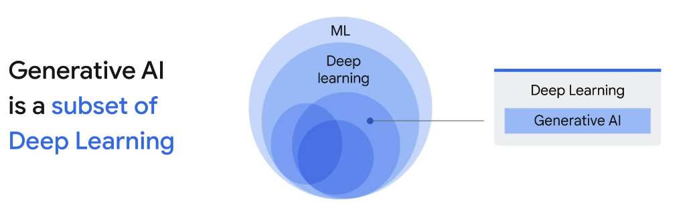

## 1. Introduction to Generative AI

- AI is the theory and development of computer systems able to perform tasks normally
  requiring human intelligence.
- ML (Machine Learning) gives computers the ability to learn without explicit programming.
  - Unsupervised ML models (not labeled)
  - Supervised ML models
  - Reinforcement learning
  - Deep learning, is a subset of ML, using Artificial Neural Networks
    - Generative AI, is a subset of Deep learning
    - Large Language Models (LLMs) are also a subset of Deep learning

- A prompt is a short piece of text that is given to the large language model as input,
  and it can be used to control the output of the model in many ways.
- A foundation model is a large AI model pretrained on a vast quantity of data
  that was "designed to be adapted” (or fine-tuned) to a wide range of downstream tasks,
  such as sentiment analysis, image captioning, and object recognition.
- Hallucinations are words or phrases that are generated by the model
  that are often *nonsensical or grammatically incorrect*. It can be caused by:
  - The model is not trained on enough data.
  - The model is trained on noisy or dirty data.
  - The model is not given enough context.
  - The model is not given enough constraints.
- Generative AI is a type of artificial intelligence (AI) that can create new content,
  such as text, images, audio, and video. It does this by learning from existing data
  and then using that knowledge to generate new and unique outputs.
